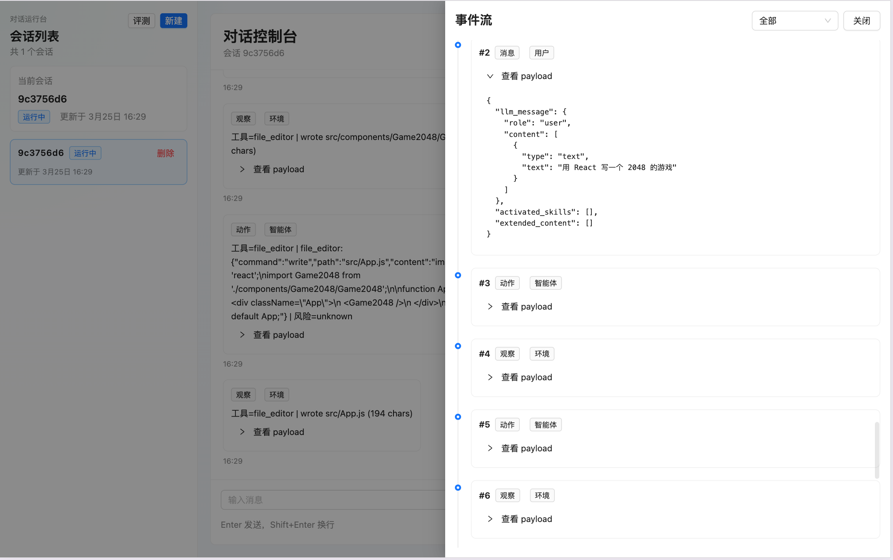
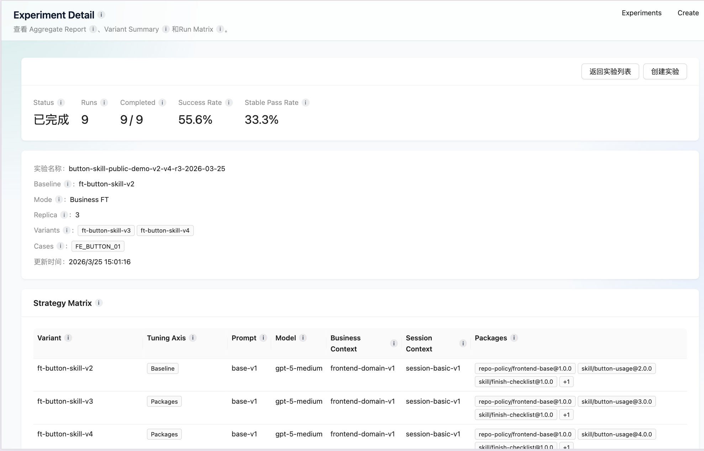

# Coding Agent Runtime

一个面向业务前端团队的 `Evaluation-Driven Coding Agent Runtime`。

核心目标：基于评测驱动的Coding Agent，可执行、可追踪、可审批、可比较、可持续调优的工程闭环。

仓库目录：

- `apps/*`：可运行的 API 和前端
- `packages/*`：共享 runtime、backend 和 worker 逻辑
- `packages/conversation`：对应 Coding Agent
- `packages/evaluation`：对应评测调优平台
- `packages/evaluation-assets`：评测 case、variant、profile、context package 和 demo repo

## 为什要做？

1. 从业务视角来看

   1. LLM 变强之后，业务适配成为关键瓶颈
   2. 如何高效调整上下文工程，成为提高交付能力的核心问题
2. 从平台视角来看

   1. 模型迭代很快，平台需要快速验证与适配能力
   2. 新技术演进很快，平台需要快速试验与落地能力
   3. 需要基于历史数据持续优化平台，并对失败案例做归因

## 做了什么？

1. 分层的 Agent Runtime

   1. Reasoning-Action Loop：负责Agent的Reasoing、Action、Observation闭环
   2. Event：负责执行过程中的事件流转与状态驱动
   3. Workspace：承接任务执行时的工作空间（文件、代码、上下文资源）
   4. Conversation：承接多轮任务上下文与执行历史
   5. **Trace**：轨迹收集
2. 上下文工程

   * **Skills 工程（Skills Engineering）**
   * **Prompt 工程（Prompt Engineering）**
   * **Tool Schema**
   * 等等
3. 评测调优平台

   * **任务 case 管理**：沉淀不同类型的任务 case
   * **上下文 variant 管理**：支持对同一任务构造不同上下文方案进行对比
   * **judge 机制**：对结果做自动化或半自动化判断
   * **批量离线评测**：支持在非线上环境批量跑实验
   * **A/B 调优沉淀**：将不同 Prompt、Skills、上下文方案的效果做结构化记录

### 1. Coding Agent 平台



### 2. 评测调优平台



## 两类优化场景

项目主线是两条：

### 1. 平台优化

平台优化关注的是“agent 平台本身怎么变强”。

主要调的变量是：

- `prompt_version`
- `enabled_skills`
- `model_profile`
- `business_context_profile`
- `session_context_policy`

它回答的问题是：

- 平台该怎么组织上下文
- 技能该怎么触发
- 模型该怎么选
- 长任务状态该怎么续接

对应的公共证据链在评测系统里，核心是固定 `case + variant + judge`，再做单变量比较。

### 2. 业务优化

业务优化关注的是“同一个业务 case，业务知识包怎么变强”。

它主要围绕：

- `packages/evaluation-assets/context-packages`
- `packages/evaluation-assets/repos/demo-shop`
- `replica_count`
- package telemetry

它回答的问题是：

- 业务 skill 包到底有没有被加载
- 是否真的被激活
- 激活之后是否真的提高成功率和稳定性

## 业务优化闭环

我们把 `FE_BUTTON_01` 作为展示样例：

- 固定同一个 case
- 固定同一个代码初始状态
- 只变 `button-usage` skill package 的版本
- 跑 `3 replicas`，看稳定性而不是只看单次成功

这个闭环最后会被拆成四层证据：


| 层级               | 关注点                   |
| ------------------ | ------------------------ |
| `Loaded`           | package 是否进入 runtime |
| `Activated`        | skill 是否真的被触发     |
| `Success Rate`     | 是否真的通过 judge       |
| `Stable Pass Rate` | 多次运行是否都稳定通过   |

**实验图展示**


**结果**


| 版本                 | Loaded | Activated | Success Rate | Stable Pass Rate | 结论                                 |
| -------------------- | ------ | --------- | ------------ | ---------------- | ------------------------------------ |
| `ft-button-skill-v2` | `3/3`  | `0/3`     | `33.33%`     | `0%`             | 加载了，但没有激活                   |
| `ft-button-skill-v3` | `3/3`  | `3/3`     | `33.33%`     | `0%`             | 激活了，但内容还不够强               |
| `ft-button-skill-v4` | `3/3`  | `3/3`     | `100%`       | `100%`           | 激活了，并且把稳定通过率拉到了`100%` |

这说明优化的不是一次性的 prompt 运气，而是可复现、可解释的业务优化流程。

完整报告

- [report.md](../../runtime-data/artifacts/reports/c5fdae72-070b-4423-a31d-53adcd878fc1.report.md)
- [`packages/evaluation-assets/demo/button-skill-public-demo.payload.json`](packages/evaluation-assets/demo/button-skill-public-demo.payload.json)

## 代码结构

- [`apps/conversation-api/src/server.ts`](apps/conversation-api/src/server.ts)：对话运行时 API
- [`packages/backend-core/src/conversation/runtime/manager.ts`](packages/backend-core/src/conversation/runtime/manager.ts)：会话、事件、审批和 run 编排
- [`apps/conversation-frontend/src/main.tsx`](apps/conversation-frontend/src/main.tsx)：对话前端
- [`apps/evaluation-api/src/server.ts`](apps/evaluation-api/src/server.ts)：评测 API
- [`packages/backend-core/src/evaluation/services/run-orchestrator.ts`](packages/backend-core/src/evaluation/services/run-orchestrator.ts)：评测执行主链路
- [`apps/evaluation-frontend/src/main.tsx`](apps/evaluation-frontend/src/main.tsx)：评测前端
- [`packages/evaluation-assets/README.md`](packages/evaluation-assets/README.md)：评测资产说明

## 快速开始

### 1. 准备环境

```bash
cp .env.example .env
docker compose up -d
pnpm install
pnpm db:generate
```

### 2. 启动对话闭环

```bash
pnpm dev:conversation-api
pnpm dev:front
```

### 3. 启动评测闭环

```bash
pnpm dev:evaluation-api
pnpm dev:eval
```

### 4. 启动 worker

```bash
pnpm dev:worker
```

## 核心路由

### Conversation

- `POST /conversations`
- `GET /conversations`
- `GET /conversations/{conversation_id}/events`
- `GET /conversations/{conversation_id}/events/stream`
- `POST /conversations/{conversation_id}/messages`
- `GET /conversations/{conversation_id}/runs`
- `GET /conversations/{conversation_id}/runs/{run_id}`
- `POST /conversations/{conversation_id}/actions/{action_id}/approve`
- `POST /conversations/{conversation_id}/actions/{action_id}/reject`

### Evaluation

- `GET /api/v1/catalog/cases`
- `GET /api/v1/catalog/variants`
- `POST /api/v1/experiments`
- `GET /api/v1/experiments`
- `GET /api/v1/experiments/{experiment_id}`
- `POST /api/v1/experiments/{experiment_id}/run`
- `GET /api/v1/runs/{run_id}`
- `POST /api/v1/runs/{run_id}/run`
- `POST /api/v1/runs/{run_id}/rerun`
- `POST /api/v1/runs/{run_id}/cancel`
- `GET /api/v1/runs/{run_id}/trace-events`
- `GET /api/v1/artifacts/{run_id}/{kind}`

## 当前边界

- 平台优化和业务优化是围绕固定 benchmark 的工程调优，而不是训练型项目。
- workspace 是可审计的工程边界，不是生产级容器 sandbox。
- benchmark 的目标是帮助业务前端团队做定向调优，不是做通用排行榜。
